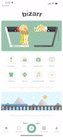

# **Bizarr**
Capstone for Grace Hopper 2109
A marketplace app that is fully integrated with mapping, allowing users to find exactly what they're searching for.

## Table of Contents
- [Introduction](#introduction)
- [Tech Stack](#tech-stack)
- [Features](#features)
- [Getting Started](#next-steps)
- [Next Steps](#creators)
- [Creators](#creators)
- [Acknowledgements](#acknowledgements)

## Introduction
Bizarr is a collaborative marketplace where all users are able to buy and sell their items.

Bizarr keeps it simple but having everything you would need in a Marketplace in one simple application. Bizarr uses your location in order to find the listing close to you and pinpoints it to the map for your convenience. Users can also chat with each other about items in order to discuss any details and finalize their purchases. No more fuss and no more uncertainty about when and where your desired item will be in your hands.

Watch our full 4-minute demo video [here](https://www.youtube....) or a short one-minute demo [here](https:www.youtube...)

## Tech Stack

- React native
- Firebase (Firestore & Authentication)
- Cloudinary
- Expo (and Expo Image Picker)
- Node. js
- XCode Simulator 
- Google Places API
- LottieView (for animation)

## Features

### Create an account
First register by entering your full name, email, and a password! Then, navigate to My Account using the bottom navigator and go to Account details to finish setting up your account with Bizarr!

(assets/apple-touch-icon.png)[image or screencast]

### Homepage navigation with map view
After login, users can see the Home screen. There are 4 sections in the home screen. First one is the category section, users can find their product through click into different categories. After that, it’s a map view. In the map view, users can see all products near to them based on the user's current location. Meanwhile, they can also click a marker in the map and see the listing's detailed information. Next section in Homescreen is New Listings. There are 6 new listings that the seller just posted. In this way, users can check the latest listings. The last section is Made for You. In this section, there will be 10 random items that are recommended to users.

### View all our product listings
Starting at the Homepage, you can see all the products our users have listed that are near you on the map, as well as latest listings and a special section of listings made just for you! You can also click on ‘All Listings’ in the bottom navigator to scroll through a list of products. You can also tap the filter icon to sort items by price in descending order. Additionally, user can search a listing through the key works in the search bar. Listings are filtered by every single letter that user put into search bar.

(assets/apple-touch-icon.png)[image or screencast]

### Post a product
Click on the post button in the middle of the bottom navigator to switch to the Post Listing screen, which will prompt you to enter information about and images of your product. Enter a location you would like for people to pick up the product — it could be a specific address or just the city that you’re in. Your product’s location will automatically be rendered in the map view! Once you’re done, click ‘Post’ and you should see your product under the 'My Listings' screen in your account page.



(assets/apple-touch-icon.png)[image or screencast]

### Contact sellers
When you see a product you are interested in, you can click on it to bring up information about that specific product, including the seller’s information and a ‘Message’ button to contact the seller. Any messages you send to sellers can be viewed by navigating to the ‘Messages’ screen in the bottom navigator

(assets/apple-touch-icon.png)[image or screencast]

### Change account details
When a user is logged in and signed up, they can navigate to the 'Account Details' screen to change their email, password, profile and profile picture.

(assets/apple-touch-icon.png)[image or screencast]

### Marked as sold
In 'My listings' under 'Account Screen', users can see their own posts. Navigate into a single listing, there is a button with Available. If that item is sold, users can toggle the button and mark it as sold. Then the sold item will be pushed into 'Sold History'. 

### Favorite listings
In 'All Listings' screen, if user tab the heart in a single item, they can save them into 'Saved' under Account Screen. Users can de-selected if they don't want to save them anymore.

## Getting Started
1. Fork and clone this repo, then npm install or expo install
2. Create a file in Bizarr folder as secret.js
3. Follow this tutorial and create a project in fire base [https://www.youtube.com/watch?v=eeGKcZGkKrc]
4. Follow this tutorial and create your own Google API key [https://www.youtube.com/watch?v=xLHiVsR7hX0]

````git
cd Bizarr && touch secret.js 
````
Put all your firebase configs and google api key from firebase into secret.js as this:

````javascript
process.env.FIRESTORE_API_KEY = "YOUR KEY";
process.env.FIRESTORE_AUTH_DOMAIN = "YOUR AUTH_DOMAIN";
process.env.FIRESTORE_DATABASE_URL = "YOUR DATABASE_URL";
process.env.FIRESTORE_PROJECT_ID = "YOUR FIREBASE PROJECT ID";
process.env.FIRESTORE_STORAGE_BUCKET = "YOUR STORAGE_BUCKET";
process.env.FIRESTORE_MESSAGING_SENDER_ID = "YOUR MESSAGING_SENDER_ID";
process.env.FIRESTORE_APP_ID = "YOUR FIRESTORE_APP_ID";

process.env.GOOGLE_PLACES_API_KEY = "YOUR OWN GOOGLE API KEY";
````
4. Start this project: npm start/expo start

*** You may need to reconfigure some other files that call these keys to match what you have in this file *** 

## Next Steps
The future of Bizarr includes making our application accessible to Android users and adding a payment function so that users can actually complete their transactions in-app. We may also add a calendar so that users can choose dates and times for their meet-ups. 

## Creators
- :blue_heart:   Grace Lin: [Github](https://github.com/gracelin95) | [Linkedin](https://www.linkedin.com/in/gracesqlin/)
- :green_heart:   Liat Guvenc: [Github](https://github.com/liat-g) | [Linkedin](https://www.linkedin.com/in/liat-guvenc-8394b0179/)
- :yellow_heart:   Zoe Zhang: [Github](https://github.com/YizhuoZhang3) | [Linkedin](https://www.linkedin.com/in/zoezhang33/)
- :purple_heart:   Sen Cai: [Github](https://github.com/sencaichi) | [Linkedin](https://www.linkedin.com/in/sentsai/)

## Acknowledgements :heart:
Bizarr cannot express enough thanks to our fellows and instructors for their continued support and encouragement: [Josephine Wang](https://github.com/joseewang) | [McKenna Warren](https://github.com/mckennakayyy) | [Ben Rodriguez](https://github.com/b17z)


